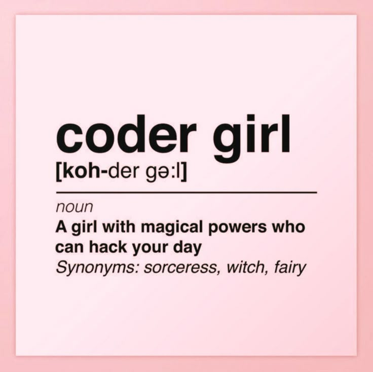

<!--
**rebecafrancog/rebecafrancog** is a ✨ _special_ ✨ repository because its `README.md` (this file) appears on your GitHub profile.

Here are some ideas to get you started:

- 🔭 I’m currently working on ...
- 🌱 I’m currently learning ...
- 👯 I’m looking to collaborate on ...
- 🤔 I’m looking for help with ...
- 💬 Ask me about ...
- 📫 How to reach me: ...
- 😄 Pronouns: ...
- ⚡ Fun fact: ...
-->

  

Estudante de Análise e Desenvolvimento de Sistemas. Sou movida por uma paixão genuína por aprender. Encaro cada novo desafio como uma oportunidade de crescimento e me envolvo com dedicação em tudo o que estudo. Constantemente busco aprimorar minhas habilidades e a tecnologia não é apenas uma escolha profissional para mim — é um campo que me desperta curiosidade, motivação e entusiasmo todos os dias.

 

 
  
  
   

 

  
  
  
  
  
  

 

